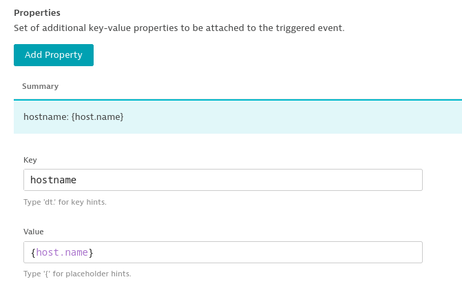
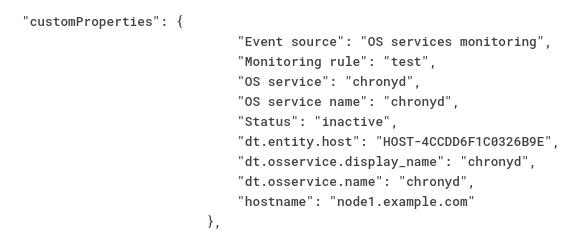

Setup Dynatrace Demo
=========

* Deploys dynatrace agent to linux or windows guest

Requirements
------------

* Have an existing Dynatrace platform available
* Have ansible-core installed

Required Variables
------------

These variables are needed to deploy and configure sensu

| Name                      | Default value         |                                                                                  |
|---------------------------|-----------------------|----------------------------------------------------------------------------------|
| oneagent_environment_url  |                       | url for Dynatrace platform                                                       |
| oneagaent_paas_token      |                       | token for Dynatrace. Retrieved through the Web UI.                               |
| oneagent_local_installer  |                       | path to oneagent script or exe on local control node.                            |

Deploying Dynatrace agent
------------

1. Clone this repo

2. Run the playbook.

```bash
ansible-playbook install_oneagent.yml -i someclient.example.com, 
```

4. Check the client is reporting in to Dynatrace web console.

Configuring dynatrace server
------------

1. Make Dynatrace send events without a delay.

Dynatrace does some clever correlation when it recieves alerts from clients. For a demo this can mean a 2 minute wait from an event being recieved and EDA being triggered. You can bypass this wait as follows:

In Dynatrace settings -> OS Services Monitoring -> select policy

You can set these properties to bypass the clever AI stuff and just fire the alerts

```bash
dt.davis.analysis_time_budget: 0
dt.davis.analysis_trigger_delay: 0
```

2. Send hostname of affected client

In order for EDA to know what host it should remediate, you might need to update the following:

Settings -> Monitoring -> OS Services Monitoring -> select policy or create a new one



Now the hostname should be sent:


