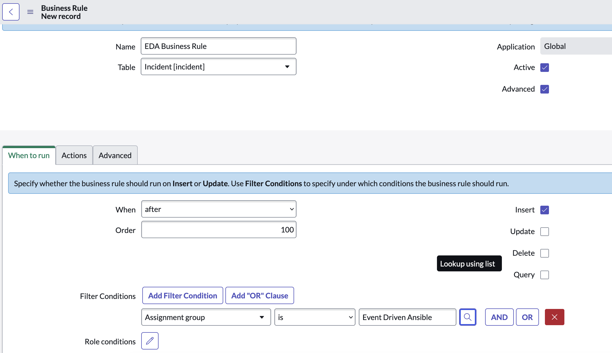

Setup ServiceNow incident demo
=========

For this demo, we use ServiceNow business rules to send event to EDA each time an incident is opened. ServiceNow is the event source not the monitoring platform. 


ServiceNow Business rule
------------

Setup a business rule in ServiceNow. Navigate to **Activity subscriptions** -> **Administration** -> **Business rules** or just search for **Business rules**. Click "New" to create a new business rule. Fill in the first form:

* Enter a name for the business rule
* Table should be set to **Incident**
* Tick the **Advanced** checkbox

In the **When to Run** section:

* Set action on insert.
* when to run should be "after".
* Add a condition. For example assignment group is equal to "Event Driven Ansible".




On the **advanced** tab, paste this sample script. This will send a json payload to EDA which contains the CI name, incident number and incident short description.

```bash
(function executeRule(current, previous /*null when async*/ ) {
 try {
 var r = new sn_ws.RESTMessageV2();
 // Enter EDA URL and port number here. In this one we have eda.example.com port 5000.
 r.setEndpoint("http://eda.example.com:5000/endpoint");
 r.setHttpMethod("post");

 // some stuff to get ci name instead of id

 var ci = new GlideRecord('cmdb_ci');
 ci.get('sys_id', current.getValue("cmdb_ci"));
 var ci_name = ci.getValue('name');

 var number = current.getValue("number");	
 var short_description = current.getValue("short_description");
 var cmdb_ci = current.getValue("cmdb_ci");	

 var obj = {
 "number": number,
 "short_description": short_description,
 "ci_name": ci_name,

 };
		
 var body = JSON.stringify(obj);
 gs.info("Webhook body: " + body);
 r.setRequestBody(body);

 var response = r.execute();
 var httpStatus = response.getStatusCode();
 } catch (ex) {
 var message = ex.message;
		gs.error("Error message: " + message);
 }

 gs.info("Webhook target HTTP status response: " + httpStatus);

})(current, previous);
```

This was adapted from https://www.transposit.com/devops-blog/itsm/creating-webhooks-in-servicenow/


AAP setup
------------

Edit vault file with ServiceNow and controller details:

```bash
ansible-vault edit group_vars/all/vault.yml 
```

Run the playbook to configure controller:

```bash
ansible-navigator run configure_controller.yml --ask-vault-pass
```

Extra manual steps I haven't automated yet:

* Create a token for eda application and paste into EDA controller
* Create rulebook and project in EDA controller
* Ensure ServiceNow host has relevant CI in the Linux DB
* Add the same CI to the Demo inventory in controller
* Paste the aap users private key into the credential in controller
